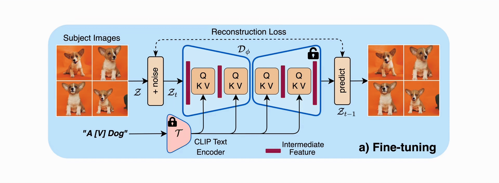

<!-- <div align="center">
    <h2 align="center" style="font-size: 45px; font-weight: bold;">
    <br>🚀 DiffuseKronA</br>
    <a href="https://diffusekrona.github.io/">Webpage</a> &nbsp;|&nbsp;
    <a href="https://openaccess.thecvf.com/content/WACV2025/papers/Marjit_DiffuseKronA_A_Parameter_Efficient_Fine-Tuning_Method_for_Personalized_Diffusion_Models_WACV_2025_paper.pdf">Paper</a> &nbsp;|&nbsp;
    <a href="https://www.youtube.com/watch?v=BLpPFKcPKNY">Video</a> &nbsp;|&nbsp;
    <a href="https://github.com/diffusekrona/Data">Dataset</a>
    </h2>
</div> -->

<!-- <p align="center">
    <h1  align="center" style="font-size: 50px; font-weight: bold; margin-bottom: 0">🚀 DiffuseKronA
    <p style="font-size: 20px; margin-top: 0">
        <a href="https://diffusekrona.github.io/">Webpage</a> &nbsp;|&nbsp;
        <a href="https://openaccess.thecvf.com/content/WACV2025/papers/Marjit_DiffuseKronA_A_Parameter_Efficient_Fine-Tuning_Method_for_Personalized_Diffusion_Models_WACV_2025_paper.pdf">Paper</a> &nbsp;|&nbsp;
        <a href="https://www.youtube.com/watch?v=BLpPFKcPKNY">Video</a> &nbsp;|&nbsp;
        <a href="https://github.com/diffusekrona/Data">Dataset</a>
    </p>
    <h1 style="font-weight: bold; margin-bottom: 0"> 💡 Highlight
    </h1></h1>
</p> -->


<div align="center">

## 🚀 DiffuseKronA <br> [Webpage](https://diffusekrona.github.io/) | [Paper](https://example.com/paper) | [Video](https://youtube.com) | [Dataset](https://github.com/data)<br> <p align="left">💡 Highlight</p>
</div>
✔️ Parameter Efficient: A minimum 35% reduction in parameters. By changing Kronecker factors, we can even achieve up to a 75% reduction with results comparable to LoRA-DreamBooth.<br/>
✔️ Enhanced Stability: Our method is more stable compared to LoRA-DreamBooth. Stability refers to variations in images generated across different learning rates and Kronecker factor/ranks, which makes LoRA-DreamBooth harder to fine-tune.<br/>
✔️ Text Alignment and Fidelity: On average, DiffusekronA captures better subject semantics and large contextual prompts.<br/>
✔️ Interpretability: Leverages the advantages of the Kronecker product to capture structured relationships in attention-weight matrices. More controllable decomposition makes DiffusekronA more interpretable.<br/>

<!-- <video width="1190" height="438" controls><source src="/assets/diffusekrona.mp4" type="video/mp4"> -->
## 🔥 Method Details

<br>
<div class="gif">
<p align="center">

</p>
</div>


## 🛠️ Installation Steps

1. Create conda environment
```
conda create -y -n diffusekrona python=3.11
conda activate diffusekrona
```

2. Package Installations
```
pip install -e ".[torch]" # To install HuggingFace Diffusers library
pip install -r requirements.txt # To install extra requirements
pip install accelerator
```

3. Install CLIP
```
pip install git+https://github.com/openai/CLIP.git
# RUN `conda install --yes -c pytorch pytorch=1.7.1 torchvision cudatoolkit=11.0`, only when pip fails
```

4. Train dreambooth_sdxl using script file
```
cd diffusekrona/                                        # Run inside diffusekrona folder
bash run_lora_sdxl.sh                                   # when only one GPU
CUDA_VISIBLE_DEVICES=$GPU_ID bash run_lora_sdxl.sh      # when having only one GPU
```

Generate images from the finetuned weights 
```
python generator.py
```

## What to run?
To run without text encoder config please hit this inside ```dreambooth``` folder
```
bash dreambooth/test.sh
```


To run with text encoder config please hit this inside ```dreambooth``` folder
```
bash test_text.sh
```

## ♥️ Acknowledgement
Our codebase is built on top of the Hugging Face [Diffusers](https://github.com/huggingface/diffusers) library, and we’re incredibly grateful for their amazing work!

## ✏️ Citation
If you think this project is helpful, please feel free to leave a star⭐️ and cite our paper:

```bash
@InProceedings{Marjit_2025_WACV,
    author    = {Marjit, Shyam and Singh, Harshit and Mathur, Nityanand and Paul, Sayak and Yu, Chia-Mu and Chen, Pin-Yu},
    title     = {DiffuseKronA: A Parameter Efficient Fine-Tuning Method for Personalized Diffusion Models},
    booktitle = {Proceedings of the Winter Conference on Applications of Computer Vision (WACV)},
    month     = {February},
    year      = {2025},
    pages     = {3529-3538}
}
```
## ✉️ Contact

Shyam Marjit: marjitshyam@gmail.com or shyam.marjit@iiitg.ac.in